# Componentes Fundamentales de Jetpack Compose

Esta guía de estudio detalla los elementos principales que utilizaremos para construir interfaces declarativas en Android. 

## Text

* **Qué es:** Es el componente principal para renderizar cadenas de texto en pantalla, equivalente al antiguo `TextView` del sistema de vistas XML.
* **Uso:** Se emplea para mostrar títulos, párrafos descriptivos, etiquetas de datos o mensajes para el usuario.

### Parámetros principales

* **`text` (Obligatorio):** La cadena de caracteres (`String`) que se va a mostrar en pantalla.
* **`fontSize`:** El tamaño de la fuente. En Android **siempre se debe usar la unidad `sp`** (Scale-independent Pixels) en lugar de `dp`, para que el texto respete las preferencias de tamaño de accesibilidad del usuario.
* **`fontWeight`:** Define el grosor del trazo de la letra (ej. `FontWeight.Bold` para negrita, `FontWeight.Light` para fina).
* **`color`:** Establece el color de la fuente.
* **`textAlign`:** Alinea el texto dentro de su contenedor (ej. `TextAlign.Center`, `TextAlign.End`, `TextAlign.Justify`).
* **`maxLines` y `overflow`:** Trabajan juntos. `maxLines` limita el número de líneas visibles, y `overflow` define qué pasa con el texto sobrante (por ejemplo, `TextOverflow.Ellipsis` añade los clásicos tres puntos "...").

### Modificadores comunes
* `Modifier.padding()`: Añade espacio interno o externo alrededor del texto.
* `Modifier.fillMaxWidth()`: Fuerza al componente a ocupar todo el ancho de su contenedor padre.
* `Modifier.background()`: Aplica un color de fondo específico al área del texto.

**Ejemplo de código:**
```kotlin
Text(
    text = "¡Bienvenidos al módulo de DAM!",
    fontSize = 24.sp,
    fontWeight = FontWeight.Bold,
    modifier = Modifier.padding(16.dp)
)
```

**Resultado**
<p style="text-align: center">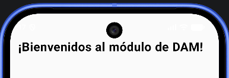</p>

---

## Icon

* **Qué es:** Un componente diseñado específicamente para mostrar gráficos vectoriales (SVG o VectorDrawables) de un solo color, respetando las guías de Material Design.
* **Uso:** Ideal para iconografía de navegación, indicadores visuales dentro de botones o acciones de menús.

### Parámetros principales

* **`imageVector` o `painter` (Obligatorio):** Recibe el recurso gráfico a mostrar. Usamos `imageVector` si proviene de las librerías de código de Compose, o `painter` (mediante `painterResource`) si es un archivo XML en nuestra carpeta de recursos.
* **`contentDescription` (Obligatorio):** Texto descriptivo para lectores de pantalla. Si el icono es puramente estético y no aporta información (por ejemplo, un icono de estrella decorativo), se le debe pasar el valor `null`.
* **`tint`:** Aplica un color sólido a todo el vector (tinte). Por defecto, Compose le asigna el color principal del tema activo, pero puedes sobrescribirlo.

### Modificadores comunes

* `Modifier.size()`: Define las dimensiones exactas del icono (por defecto suele ser 24.dp).


**Ejemplo de código:**

```kotlin
Icon(
    imageVector = Icons.Filled.Favorite,
    contentDescription = "Añadir a favoritos",
    tint = Color.Red,
    modifier = Modifier.size(32.dp)
)

```

### ⚠️ Buenas prácticas: Material Symbols vs Material Icons

Al buscar ejemplos en internet, es muy común encontrar código que utiliza iconos integrados mediante `imageVector` (ej. `Icons.Filled.Home`). Aunque funciona, **la documentación oficial de Android desaconseja su uso** en proyectos nuevos. 

La librería clásica de `Material Icons` ralentiza notablemente los tiempos de compilación y tiene una estética anticuada. El estándar actual de la industria es utilizar **Material Symbols**.

**Flujo de trabajo moderno:**
1. Accede al catálogo oficial en [Google Fonts: Icons](https://fonts.google.com/icons).
<p style="text-align: center">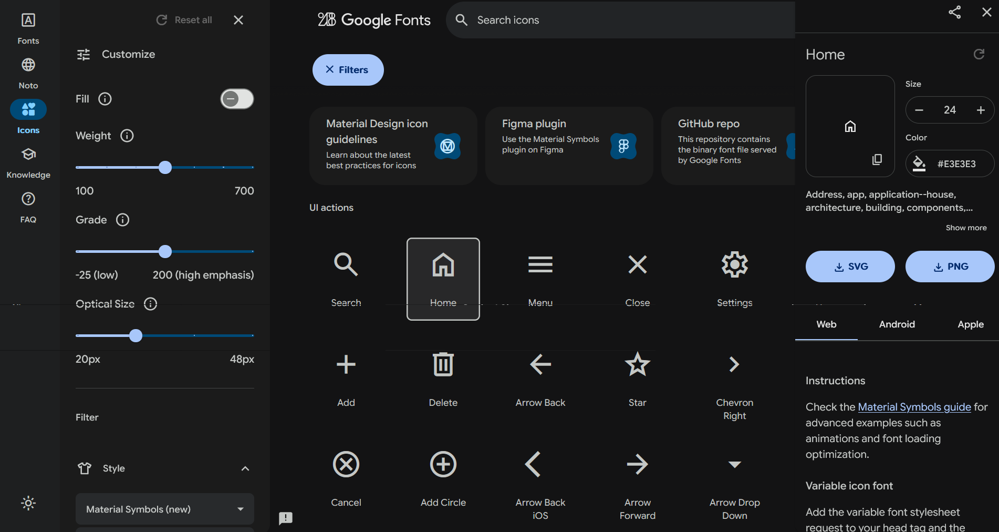</p>

2. Selecciona el icono y ajusta sus propiedades (relleno, grosor, grado).
3. Descarga la versión en **XML (Android)**.
4. Arrastra el archivo descargado a la carpeta `res/drawable` de tu proyecto.
5. Invócalo en Jetpack Compose utilizando `painterResource`, tratándolo como un recurso local.

**Ejemplo de código actualizado:**
```kotlin
Icon(
    // En lugar de usar imageVector, cargamos el XML descargado
    painter = painterResource(R.drawable.home_icono2),
    contentDescription = "Añadir a favoritos",
    tint = Color.Red,
    modifier = Modifier.size(32.dp)
)

Icon(
    painter = painterResource(R.drawable.home_icono),
    contentDescription = "Añadir a favoritos",
    tint = Color.Red,
    modifier = Modifier.size(32.dp)
)
```
<p style="text-align: center">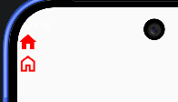</p>


> 💡 **Debate de Rendimiento: Código vs Archivos XML**
> 
> Podrías pensar que leer un archivo XML desde la carpeta `drawable` con `painterResource` es más lento que usar un `imageVector` que ya está escrito directamente en código Kotlin. **Y técnicamente, tienes razón.**
>
> Sin embargo, para tener todos los iconos en código Kotlin, hay que importar una librería enorme (`material-icons-extended`) que añade miles de Composables al proyecto. Esto penaliza severamente el **tiempo de compilación** (tardarás mucho más en ver los cambios en el emulador) y aumenta el peso final del APK. 
>
> Por ello, el estándar de la industria prioriza **importar solo los XML estrictamente necesarios**. Android optimiza estos XML al compilar (convirtiéndolos a binario), haciendo que el coste de carga en tiempo de ejecución sea totalmente imperceptible.


---

## Image

* **Qué es:** El componente homólogo a `ImageView`, encargado de renderizar imágenes en mapa de bits (PNG, JPG, WEBP) o vectores complejos.
* **Uso:** Mostrar fotografías, avatares de perfil de usuario, banners publicitarios o ilustraciones detalladas.

### Parámetros principales

A diferencia de los modificadores que alteran el contenedor exterior, estos parámetros controlan el contenido interno de la propia imagen:

* **`contentDescription` (Obligatorio):** Texto descriptivo para los lectores de pantalla (como TalkBack). Es fundamental para la accesibilidad. Si la imagen es puramente decorativa y no aporta información, se debe pasar `null`.
* **`contentScale`:** Define cómo se ajusta la imagen si sus dimensiones originales no coinciden con el tamaño de su contenedor (es el equivalente directo al antiguo `scaleType` de XML). Los valores más importantes para los alumnos son:
  * `ContentScale.Crop`: Escala la imagen manteniendo su proporción original hasta que **rellena por completo** el contenedor. Si la imagen es más ancha o alta que el hueco, el excedente se recorta. Es el valor estándar para fotos de perfil o miniaturas.
  * `ContentScale.Fit`: Escala la imagen manteniendo la proporción para que **se vea entera** dentro del contenedor. Si las proporciones no coinciden, aparecerán bandas vacías (transparentes) a los lados o arriba y abajo.
  * `ContentScale.FillBounds`: Estira la imagen para ocupar el 100% del contenedor en ancho y alto, **ignorando la proporción original**. Esto provoca que la imagen se vea deformada o aplastada.
  * `ContentScale.FillWidth`: Escala la imagen para que su ancho coincida exactamente con el del contenedor, ajustando el alto proporcionalmente.

### Modificadores comunes
* `Modifier.clip()`: Recorta la imagen con una forma geométrica específica (por ejemplo, `CircleShape` para fotos de perfil redondas o `RoundedCornerShape(8.dp)` para tarjetas).
* `Modifier.border()`: Añade un contorno alrededor de la imagen.

**Ejemplo de código:**

```kotlin
Image(
    painter = painterResource(id = R.drawable.profile_picture),
    contentDescription = "Fotografía del alumno",
    contentScale = ContentScale.Crop,
    modifier = Modifier
        .size(100.dp)
        .clip(CircleShape)
)
```

<p style="text-align: center">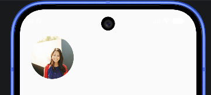</p>


---
## Buttons
<!-- [Insertar imagen de ejemplo visual de Buttons aquí] -->

* **Qué es:** Elementos interactivos que responden a las pulsaciones del usuario. Compose ofrece varias variantes semánticas (Filled, Outlined, Text, ElevatedButton).
* **Uso:** Confirmar formularios, navegar entre pantallas, o disparar eventos lógicos como guardar en la base de datos.

### Parámetros principales

* **`onClick` (Obligatorio):** Recibe una función lambda `{}` con el código que se ejecutará cuando el usuario pulse el botón.
* **`enabled`:** Un booleano (`true` o `false`). Si se pone a `false`, el botón se vuelve de color grisáceo y deja de responder a los clics. Es muy útil para bloquear el botón de "Guardar" hasta que el usuario haya rellenado todos los campos del formulario.
* **`colors`:** Permite cambiar el color de fondo y del texto usando `ButtonDefaults.buttonColors()`. 
* **`shape`:** Define la forma de los bordes. Por defecto tiene bordes redondeados, pero se puede modificar pasando, por ejemplo, `RoundedCornerShape(0.dp)` para hacerlo rectangular.

### Modificadores comunes
* `Modifier.fillMaxWidth()`: Muy usado en formularios para que el botón sea ancho y fácil de pulsar.
* `Modifier.height()`: Para definir una altura mínima si se requiere más área táctil.

**Ejemplo de código:**
```kotlin
Button(
    onClick = { /* Lógica al pulsar */ },
    enabled = true,
    colors = ButtonDefaults.buttonColors(containerColor = Color.Blue),
    modifier = Modifier
        .fillMaxWidth()
        .padding(horizontal = 16.dp)
) {
    Text(text = "Guardar Datos")
}
```

<p style="text-align: center"></p>


---

## Floating Action button

* **Qué es:** Un botón flotante destacado, con forma circular o redondeada, que se superpone al contenido principal (conocido como FAB).
* **Uso:** Representar la acción primaria y más importante de una pantalla (ej. redactar un nuevo correo, añadir un nuevo registro).

### Parámetros principales

* **`onClick` (Obligatorio):** La acción a ejecutar al pulsar.
* **`containerColor` y `contentColor`:** Definen el color de fondo del botón y el color del icono/texto de su interior, respectivamente.
* **`elevation`:** Controla la sombra proyectada por el botón para darle el efecto de "flotar" sobre el resto de la interfaz. Se configura con `FloatingActionButtonDefaults.elevation()`.

### Modificadores comunes

* Normalmente no requiere modificadores de tamaño interno. Se suele posicionar delegando su ubicación al parámetro `floatingActionButton` del componente `Scaffold`, o usando `Modifier.align(Alignment.BottomEnd)` si está dentro de un contenedor `Box`.

**Ejemplo de código:**

```kotlin
@Composable
fun Example(onClick: () -> Unit) {
    FloatingActionButton(
        onClick = { onClick() },
        containerColor = MaterialTheme.colorScheme.primary,
        elevation = FloatingActionButtonDefaults.elevation(8.dp)
    ) {
        Icon(Icons.Filled.Add, "Añadir elemento.")
    }
}
```

<p style="text-align: center">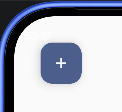</p>


---

## TopAppBar

* **Qué es:** La barra superior de navegación de la aplicación (el antiguo ActionBar o Toolbar).
* **Uso:** Mostrar el título de la pantalla actual, el botón de menú lateral/retroceso y las acciones principales de la pantalla.

### Parámetros principales

* **`title` (Obligatorio):** El bloque donde se define el texto principal (suele alojar un componente `Text`).
* **`navigationIcon`:** El espacio reservado a la izquierda del título. Se utiliza casi exclusivamente para alojar un `IconButton` con el icono de retroceso (flecha) o de menú lateral (hamburguesa).
* **`actions`:** Un bloque reservado a la derecha del título. Se utiliza para agrupar otros `IconButton` secundarios (por ejemplo, una lupa para buscar o unos puntos suspensivos para más opciones).
* **`colors`:** Permite definir los colores de la barra y sus iconos usando `TopAppBarDefaults.topAppBarColors()`.

### Modificadores comunes

* Sus modificadores suelen limitarse a aplicar `Modifier.shadow()` si se desea un efecto de elevación personalizado, ya que su ancho y alto están gestionados automáticamente por el sistema de Material Design.

**Ejemplo de código:**

```kotlin
class MainActivity : ComponentActivity() {
    override fun onCreate(savedInstanceState: Bundle?) {
        super.onCreate(savedInstanceState)
        enableEdgeToEdge()
        setContent {
            MyApplicationTheme {
                Scaffold(
                    modifier = Modifier.fillMaxSize(),
                    topBar = { AppBarExample() }
                ) { innerPadding ->
                    Column(
                        modifier = Modifier
                            .padding(innerPadding)
                            .padding(36.dp)
                    ) {
                        HelloContent()
                    }
                }
            }
        }
    }
}

@OptIn(ExperimentalMaterial3Api::class)
@Composable
fun AppBarExample() {
    TopAppBar(
        title = { Text("Listado de Alumnos") },
        navigationIcon = {
            IconButton(onClick = { /* Abrir menú */ }) {
                Icon(Icons.Filled.Menu, contentDescription = "Menú principal")
            }
        },
        actions = {
            IconButton(onClick = { /* Buscar alumno */ }) {
                Icon(Icons.Filled.Search, contentDescription = "Buscar")
            }
        },
        colors = TopAppBarDefaults.topAppBarColors(
            containerColor = Color.LightGray
        )
    )
}
```
<p style="text-align: center">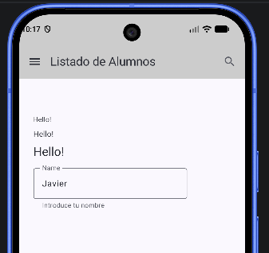</p>


---

## Badges (Badges)

* **Qué es:** Pequeñas notificaciones visuales (generalmente círculos rojos) que pueden o no contener números. Se dividen en dos componentes que trabajan juntos: `BadgedBox` (el contenedor) y `Badge` (el punto rojo).
* **Uso:** Informar al usuario de alertas pendientes, como el número de mensajes sin leer o los artículos en un carrito de la compra.

### Parámetros principales

* **`badge` (en BadgedBox):** Es el espacio donde se instancia el componente `Badge`.
* **`containerColor` (en Badge):** Permite cambiar el color de fondo de la notificación (por defecto suele ser rojo o el color de error del tema).
* **`contentColor` (en Badge):** El color del texto interior (normalmente blanco para que contraste).

### Modificadores comunes

* Se aplican directamente dentro de `BadgedBox` mediante `Modifier.offset()` si se necesita afinar su posición exacta o corregir la alineación sobre el icono que estamos decorando.

**Ejemplo de código:**

```kotlin
@OptIn(ExperimentalMaterial3Api::class)
@Composable
fun AppBarExample() {
    TopAppBar(
        title = { Text("Listado de Alumnos") },
        navigationIcon = {
            IconButton(onClick = { /* Abrir menú */ }) {
                Icon(Icons.Filled.Menu, contentDescription = "Menú principal")
            }
        },
        actions = {
            BadgedBox(
                badge = {
                    Badge(
                        containerColor = Color.Red,
                        contentColor = Color.White
                    ) {
                        Text("3")
                    }
                }
            ) {
                Icon(
                    imageVector = Icons.Filled.Notifications,
                    contentDescription = "Notificaciones"
                )
            }
        },
        colors = TopAppBarDefaults.topAppBarColors(
            containerColor = Color.LightGray
        )
    )
}
```

<p style="text-align: center">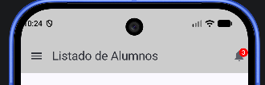</p>

---

## Switch
<!-- [Insertar imagen de ejemplo visual de Switch aquí] -->

* **Qué es:** Un componente de selección binaria (interruptor) que alterna entre dos estados: encendido o apagado.
* **Uso:** Activar o desactivar configuraciones, preferencias de usuario (ej. modo oscuro, notificaciones) o filtros.

### Parámetros principales

* **`checked` (Obligatorio):** Un valor booleano (`true` o `false`) que indica el estado actual del interruptor.
* **`onCheckedChange` (Obligatorio):** Una función lambda que se ejecuta cuando el usuario interactúa con el interruptor. Devuelve el nuevo estado sugerido, que debe usarse para actualizar la variable de estado.
* **`colors`:** Permite personalizar los colores del "pulgar" (el círculo) y la "pista" (el fondo ovalado) en ambos estados mediante `SwitchDefaults.colors()`.

**Ejemplo de código:**
```kotlin
var isChecked by remember { mutableStateOf(false) }

Switch(
    checked = isChecked,
    onCheckedChange = { nuevoEstado -> isChecked = nuevoEstado }
)
```

<p style="text-align: center">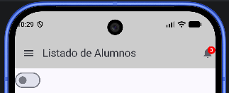</p>

---

## TextField


* **Qué es:** El campo de entrada de texto principal de Compose, equivalente al clásico `EditText` de vistas XML. Existen dos variantes principales: `TextField` (fondo sólido, base Material clásica) y `OutlinedTextField` (con borde exterior, muy popular actualmente).
* **Uso:** Formularios de registro, pantallas de inicio de sesión, barras de búsqueda o áreas de comentarios.

### Parámetros principales

* **`value` (Obligatorio):** El texto (`String`) que muestra actualmente el campo.
* **`onValueChange` (Obligatorio):** Lambda que recibe cada nuevo carácter tecleado por el usuario. Es fundamental para actualizar el estado del texto.
* **`label`:** Recibe un componente (generalmente un `Text`) que actúa como etiqueta flotante.
* **`keyboardOptions`:** Permite definir qué tipo de teclado se muestra (ej. `KeyboardType.Email`, `KeyboardType.Number`, `KeyboardType.Password`).

**Ejemplo de código:**

```kotlin
@Composable
fun ExampleTextField(){
    var nombre by remember { mutableStateOf("") }

    OutlinedTextField(
        value = nombre,
        onValueChange = { nombre = it },
        label = { Text("Nombre completo") },
        modifier = Modifier.fillMaxWidth().padding(5.dp)
    )
}
```

<p style="text-align: center">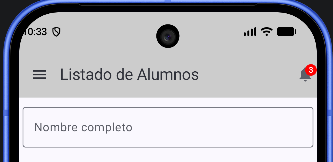</p>


---

## Card


* **Qué es:** Un contenedor visual (tarjeta) con bordes redondeados y una ligera sombra para dar sensación de elevación y jerarquía.
* **Uso:** Agrupar información relacionada en un bloque coherente (ej. el perfil de un usuario, un producto en una tienda, una noticia).

### Parámetros principales

* **`elevation`:** Define la altura proyectada de la tarjeta, lo que altera su sombra usando `CardDefaults.cardElevation()`.
* **`shape`:** La forma de las esquinas. Por defecto es redondeada, pero se puede personalizar.
* **`colors`:** Permite cambiar el color de fondo del contenedor.

### Modificadores comunes

* `Modifier.padding()`: Esencial para separar la tarjeta del resto de elementos de la lista.
* `Modifier.clickable()`: Convierte toda la tarjeta en un elemento interactivo que responde al toque.

**Ejemplo de código:**

```kotlin
Card(
    elevation = CardDefaults.cardElevation(defaultElevation = 4.dp),
    modifier = Modifier
        .fillMaxWidth()
        .padding(8.dp)
) {
    Column(modifier = Modifier.padding(16.dp)) {
        Text("Título de la Tarjeta", fontWeight = FontWeight.Bold)
        Text("Contenido descriptivo dentro del contenedor.")
    }
}
```

<p style="text-align: center">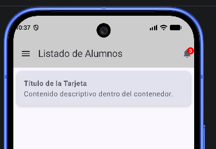</p>

---

## ProgressIndicator


* **Qué es:** Un indicador visual de carga o procesamiento. Compose ofrece dos formas geométricas: `CircularProgressIndicator` (el clásico "spinner" que da vueltas) y `LinearProgressIndicator` (una barra recta).
* **Uso:** Bloquear la interfaz e informar al usuario mientras se descargan datos de una base de datos, se carga una imagen o se espera una respuesta de red.

### Parámetros principales

Existen dos modalidades que cambian cómo se configuran los parámetros:

1. **Indeterminado:** No sabemos cuánto va a tardar (ej. conectando a un servidor). No se le pasa parámetro `progress`.
2. **Determinado:** Sabemos exactamente el progreso (ej. 50% de un archivo descargado). Se usa el parámetro `progress` (un `Float` entre 0.0 y 1.0).

**Ejemplo de código (Indeterminado):**

```kotlin
CircularProgressIndicator(
    color = MaterialTheme.colorScheme.secondary,
    strokeWidth = 4.dp
)
```

<p style="text-align: center">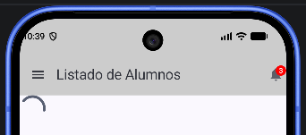</p>

---

## CheckBox

* **Qué es:** Una casilla de verificación clásica (cuadro con un "tic").
* **Uso:** Permitir selección múltiple en una lista, o acciones binarias de confirmación aisladas (ej. "Acepto los términos y condiciones").

### Parámetros principales

* **`checked` (Obligatorio):** Booleano que define si está marcado o vacío.
* **`onCheckedChange` (Obligatorio):** Lambda para capturar el cambio de estado.

### 💡 Nota para estructuración

A diferencia del antiguo XML donde el CheckBox podía tener texto propio, en Compose el `Checkbox` es **solo el cuadradito**. Para ponerle texto al lado, debes envolverlo junto con un `Text` dentro de una fila (`Row`).

**Ejemplo de código:**

```kotlin
var aceptado by remember { mutableStateOf(false) }

Row(verticalAlignment = Alignment.CenterVertically) {
    Checkbox(
        checked = aceptado,
        onCheckedChange = { aceptado = it }
    )
    Text("Acepto los términos")
}
```

<p style="text-align: center">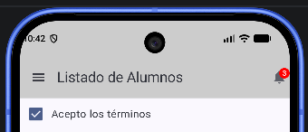</p>

---

## RadioButton


* **Qué es:** Un botón de opción con forma circular.
* **Uso:** Permitir una **única elección** dentro de un grupo de opciones mutuamente excluyentes (ej. seleccionar el género, o un método de pago).

### Parámetros principales

* **`selected` (Obligatorio):** Booleano que indica si este botón en concreto es la opción activa.
* **`onClick` (Obligatorio):** Acción a ejecutar cuando se selecciona (normalmente actualizar una variable de estado que guarda la "opción seleccionada").

**Ejemplo de código:**

```kotlin
@Composable
fun ExampleRadioButton(){
    var opcionSeleccionada by remember { mutableStateOf(1) }

    Row(verticalAlignment = Alignment.CenterVertically) {
        RadioButton(
            selected = (opcionSeleccionada == 1),
            onClick = { opcionSeleccionada = 1 }
        )
        Text("Opción 1")
    }
}
```
<p style="text-align: center">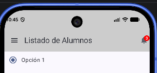</p>


---

## DatePicker


* **Qué es:** Un calendario visual complejo e interactivo para seleccionar fechas. En Material 3 para Compose, este componente viene nativo y muy estilizado.
* **Uso:** Formularios de nacimiento, selección de fechas para reservas de hotel o vuelos, filtrado de históricos.

### Parámetros principales

* **`state` (Obligatorio):** Requiere un estado complejo generado mediante la función `rememberDatePickerState()`. Este estado es el que guarda la fecha en formato *milisegundos (Epoch)* y permite leer qué día ha marcado el usuario.

**Ejemplo de código:**

```kotlin
// Componente nativo de Material 3
@Composable
fun ExampleDatePicker(){
    val datePickerState = rememberDatePickerState()

    DatePicker(
        state = datePickerState,
        modifier = Modifier.padding(16.dp)
    )
}
// Para leer la fecha seleccionada: datePickerState.selectedDateMillis
```
<p style="text-align: center">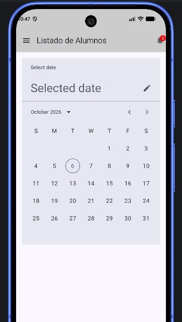</p>


---

## TimePickerDialog


* **Qué es:** Una ventana emergente (diálogo) que se superpone a la pantalla actual mostrando una interfaz de reloj para seleccionar horas y minutos.
* **Uso:** Seleccionar horas para alarmas, configurar recordatorios, introducir la hora de un evento.

### Estructura en Compose Material 3

En la API moderna de Material 3 para Compose, la selección de tiempo se maneja combinando dos elementos: un `TimePicker` (o `TimeInput` para teclear) y un contenedor de diálogo. Para mantener la consistencia visual y de estado, se requiere inicializar su propio gestor de estado.

**Ejemplo de código:**

```kotlin
@OptIn(ExperimentalMaterial3Api::class)
@Composable
fun ExampleTimePicker(){
    val timePickerState = rememberTimePickerState(
            initialHour = 12,
    initialMinute = 30,
    is24Hour = true
    )

// Normalmente esto se envuelve dentro de un componente Dialog o AlertDialog
// para que flote sobre la UI principal cuando el usuario pulsa un botón.
    TimePicker(
        state = timePickerState
    )
}

// Para leer la hora seleccionada: timePickerState.hour y timePickerState.minute
```

<p style="text-align: center">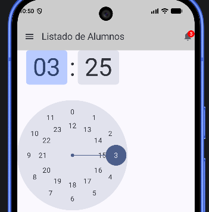</p>
